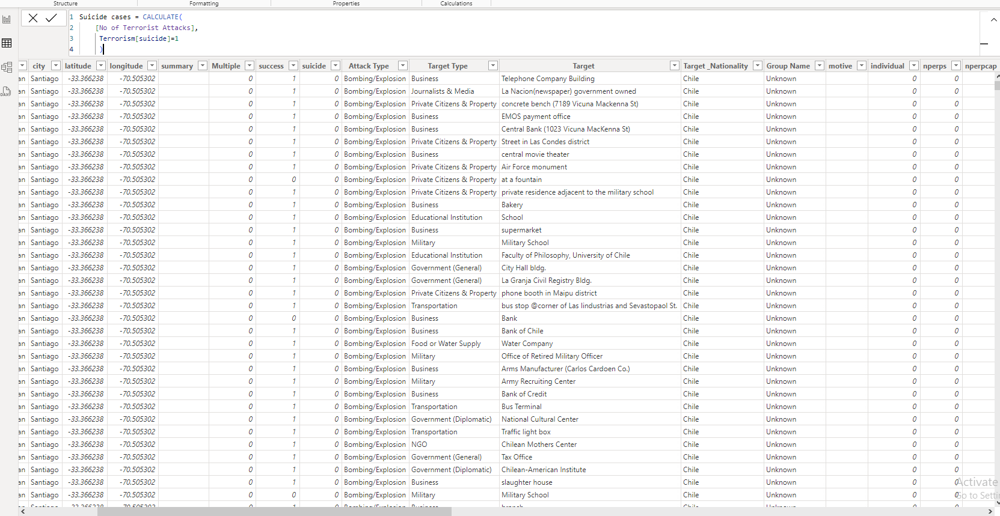
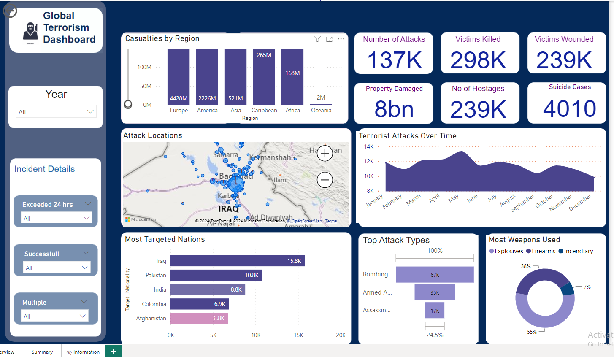
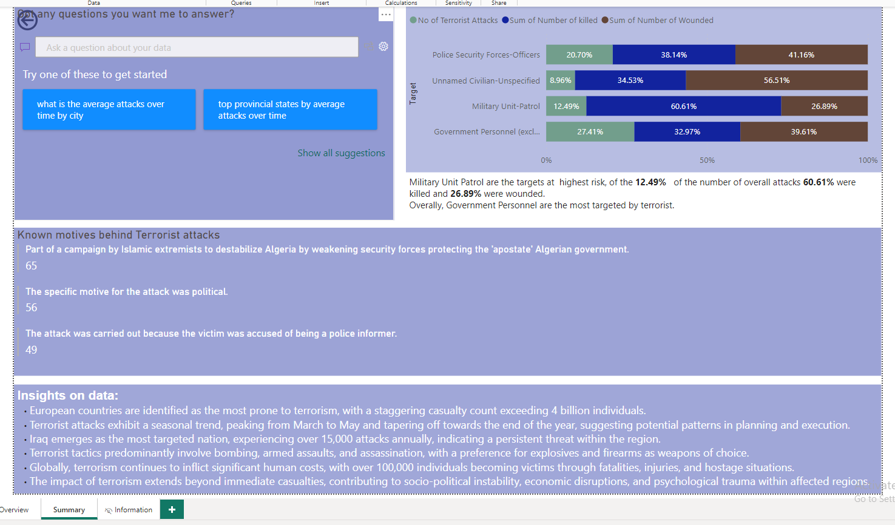

# Global-Terrorism-Analysis

Picture Source: https://www.123rf.com/photo_39216731_no-terrorism-war-on-terror-stop-terrorist-attacks.html

## Introduction

This is a Microsoft Power BI project on Global Terrorism Analysis. In today's interconnected world, the scourge of terrorism transcends borders, ideologies, and cultures, posing significant challenges to global security.
This project is aimed at analyzing the terrorist attacks in various cities, continents and the motive behind those attacks.
**_Disclaimer_** ⚠️- _All datasets and reports do not represent any real trading company or organization but just a dummy dataset to demonstrate my strengths and capacity with Microsoft Power BI._

## Analysis and Visualisation
 The data was imported as stated above and then transformed using power query editor. The null values were replaced. Problematic data were all transformed. After successfully cleaning and replacing the null values, the tables are properly checked to confirm a thorough cleaning.

2. Two calculated measures were created.
<pre><code id="sqlQuery"> CODE:✍️
Suicide cases = CALCULATE(
    [No of Terrorist Attacks],
     Terrorism[suicide]=1
     )
</code></pre><button class="btn" data-clipboard-target="#sqlQuery">

4. Two well curated dashboards were designed to display all key performance indicators and questions that were answered in the course of our analysis. These dashboards were done using well articulated charts and graphs to visualize the company's data for the different trading years. 

## Conclusion and Recommendation

Thank you for reading 🙏😃

